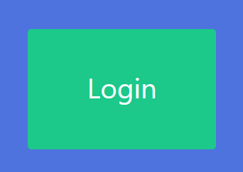

# Analytics as a Service

## Aufwand

Der Gesamtaufwand für AAAS.Web betrug etwa 45 Stunden.

## Installation

Das Web-frontend kann mit folgenden Befehlen gestartet werden, sofern Angular CLI installiert ist:

* `npm install` um die benötigten Pakete zu installieren
* `npm serve` um die Anwendung zu starten

Die Anwendung ist dann unter http://localhost:4200 erreichbar.

## Projektübersicht

Das Web-frontend dient als Manager-Interface, um die Client-Instanzen, die diesem AppKey zugeordnet sind zu verwalten. Dafür können Client-Instanzen, Detektoren und Aktionen erstellt und verwaltet werden sowie Metriken und Logs ausgewertet werden.

Auf oberster ebene findet man eine ansprechende Sidebar, die dem Nutzer direkten Zugriff auf alle Seiten bietet.

Rechts von der Sidebar befindet sich dann der Router-Outlet. Beim ersten öffnen der Seite wird ein Dashboard angezeigt, welches den Online-Status der einzelnen Clients anzeigt und Platz für Graphen bietet.

### Dashboard

Damit Clients als Online angezeigt werden, müssen sie einen aktiven Heartbeat-Detektor am Server haben. Wird ein Client abgemeldet oder stürzt unerwartet ab, wird er als Offline angezeigt. Diese Übersicht unterscheidet nicht zwischen abgemeldet und abgestürzt, da bei letzterem sowieso eine Aktion ausgelöst wird. Der Online-Status wird alle 5 Sekunden automatisch neu abgefragt.

Auf jeder Seite wird zusätzlich ein Header angezeigt, der die aktuelle Seite zeigt und das Wechseln zwischen Clients erlaubt.

Die Graphen zur Auswertung der Daten können dynamisch erstellt werden. Dabei kann zwischen Bar- Line- und Pie charts ausgewählt werden. Mit Übergabe eines Metrik-Namen wird den Diagramm mitgeteilt, welche Daten angezeigt werden sollen. Ist im Header der Eintrag "All Clients" ausgewählt, werden die Daten aller Clients verglichen. Wird ein Client ausgewählt, werden nur mehr die Daten des gewählten Clients angezeigt (Diese Anzeige ist bei Pie charts nicht sehr aussagekräftig).

Nachfolgend sind zwei Line charts zu sehen, das erste zeigt alle Clients an, das zweite nur testclient2:

Diagramme können nach belieben erstellt und gelöscht werden. Ob eine Auswertung mit einer bestimmten art von Graph sinnvoll ist, bleibt dem User überlassen. Die Diagramme bleiben auch über einen Neustart vonseiten des Clients bestehen, da sie im LocalStorage gespeichert werden.

### Detectors

Die Seite "Detectors" bietet Verwaltung von Detektoren an. Dafür muss zuerst ein Client im Header ausgewählt werden. Ist ein Client ausgewählt, werden alle dazugehörigen Detektoren in einer Liste angezeigt. Ganz oben findet man einen Button um einen neuen Detektor erstellen zu können. Jeder Detektor kann über einen einfachen Button Aktiviert/Deaktiviert werden. Durch klick auf den gelben Button kann ein Detektor bearbeitet werden, durch klick auf den roten Button wird er gelöscht.

Wird ein Detektor bearbeitet, kann der Speichern-Button nur dann gedrückt werden, wenn alle Felder korrekt befüllt sind. Um den Fehler schnell finden zu können, wird bei falschen Feldern ein Hinweis angezeigt.

Die Eingabemaske für einen neuen Detektor ist ident zur Bearbeitungsmaske.

### Actions

Ähnlich wie Detektoren werden auch Aktionen in einer Liste angezeigt. Sie können bearbeitet, gelöscht und neu Angelegt werden. Das Action Target muss gesetzt werden, bevor eine Aktion gespeichert werden kann. Bei einer Email-Aktion wird auch die Email-Adresse validiert.

### Client Instances

Client-Instanzen haben eine sehr ähnliche Übersicht. Hier können neue Clients erstellt und umbenannt werden. Löschen ist nicht vorgesehen, da Metriken von nicht mehr benötigten Clients zu archivzwecken weiterhin gespeichert werden sollen. Das umbenennen der Clients ist zwar im Frontend möglich, funktioniert aber aufgrund eines Fehlers auf Seiten der API zur Zeit nicht.

### Data view

Hier können die einzelnen Metriken noch genauer ausgewertet werden. Als Beispiel werden hier Counter-Metriken dargestellt. Die Tabellen werden entweder mit den Daten des ausgewählten Clients befüllt. Die Tabellen verfügen über Pagination, Sortierung und können durchsucht werden. Über einen Button im rechten Eck kann die Tabelle aktualisiert werden.

### Log Messages

Logmessages werden in einer ähnlichen Tabelle wie Metriken dargestellt. Auch diese Tabelle ist durchsuchbar und verfügt über Sortierung und Pagination.

## Authentifizierung

Wird die Website zum ersten mal geöffnet, sieht der Nutzer nur einen Button, der zum Login auffordert. Durch klick auf den Button wird der Nutzer auf den Identity-Server  von Manfred Steyr weitergeleitet. Nach dem Login kann die Seite ohne Einschränkungen verwendet werden.

